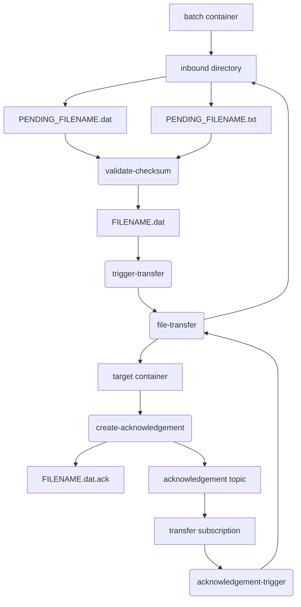

# Validate Checksum
Azure Function to validate checksum of file

Part of five Azure Functions to validate file checksum, transfer to target blob and process acknowledgment

## Repositories
- [validate-checksum](https://github.com/johnwatson484/validate-checksum)
- [transfer-trigger](https://github.com/johnwatson484/transfer-trigger)
- [file-transfer](https://github.com/johnwatson484/file-transfer)
- [create-acknowledgement](https://github.com/johnwatson484/create-acknowledgement)
- [acknowledgement-trigger](https://github.com/johnwatson484/acknowledgement-trigger)

## Sequence

## Prerequisites
- Node.js
- Azure blob storage
  - `batch` container with `inbound` virtual directory
  - `target` container
- Azure Service Bus
  - `acknowledgement` topic with `transfer` subscription
